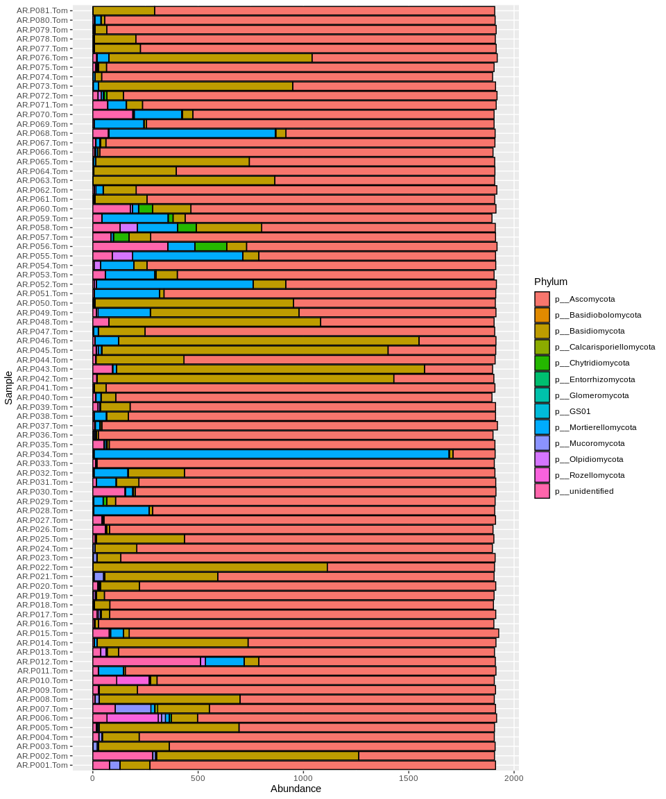

# Import data

These are the libraries used here:


```r
library(phyloseq)
library(dplyr)
```

```
## 
## Attaching package: 'dplyr'
```

```
## The following objects are masked from 'package:stats':
## 
##     filter, lag
```

```
## The following objects are masked from 'package:base':
## 
##     intersect, setdiff, setequal, union
```

```r
library(tidyr)
library(tibble)
library(ggplot2)
library(vegan)
```

```
## Loading required package: permute
```

```
## Loading required package: lattice
```

```
## This is vegan 2.5-6
```

```r
library(readr)
```

Importing biom file:


```r
#Import file
TomAR <- import_biom("otu_table_TomasARv2.fungi.biom", refseqfilename = "otu_table_TomasARv2.fungi.fasta")
```

```
## Warning in strsplit(conditionMessage(e), "\n"): input string 1 is invalid in
## this locale
```

```r
TomAR
```

```
## phyloseq-class experiment-level object
## otu_table()   OTU Table:         [ 723 taxa and 81 samples ]
## sample_data() Sample Data:       [ 81 samples by 6 sample variables ]
## tax_table()   Taxonomy Table:    [ 723 taxa by 7 taxonomic ranks ]
## refseq()      DNAStringSet:      [ 723 reference sequences ]
```

```r
#Renaming taxonomy levels on tax_table
colnames(tax_table(TomAR)) <- c("Kingdom", "Phylum", "Class","Order", "Family", "Genus", "Species")

head(tax_table(TomAR))
```

```
## Taxonomy Table:     [6 taxa by 7 taxonomic ranks]:
##        Kingdom    Phylum             Class                Order             
## OTU_7  "k__Fungi" "p__Ascomycota"    "c__Dothideomycetes" "o__Pleosporales" 
## OTU_10 "k__Fungi" "p__Ascomycota"    "c__Sordariomycetes" "o__Hypocreales"  
## OTU_12 "k__Fungi" "p__Ascomycota"    "c__Sordariomycetes" "o__Glomerellales"
## OTU_14 "k__Fungi" "p__Ascomycota"    "c__Sordariomycetes" "o__Glomerellales"
## OTU_22 "k__Fungi" "p__Ascomycota"    "c__Sordariomycetes" "o__Hypocreales"  
## OTU_24 "k__Fungi" "p__Basidiomycota" "c__Agaricomycetes"  "o__Boletales"    
##        Family                              Genus             
## OTU_7  "f__Didymellaceae"                  "g__Endophoma"    
## OTU_10 "f__unidentified"                   "g__unidentified" 
## OTU_12 "f__Plectosphaerellaceae"           "g__Gibellulopsis"
## OTU_14 "f__Plectosphaerellaceae"           "g__Verticillium" 
## OTU_22 "f__Hypocreales_fam_Incertae_sedis" "g__Trichothecium"
## OTU_24 "f__Suillaceae"                     "g__Suillus"      
##        Species                          
## OTU_7  "s__Endophoma_elongata"          
## OTU_10 "s__unidentified"                
## OTU_12 "s__unidentified"                
## OTU_14 "s__Verticillium_dahliae"        
## OTU_22 "s__Trichothecium_crotocinigenum"
## OTU_24 "s__Suillus_pseudobrevipes"
```

# Checking sequencing depth and normalizing


```r
# Make a data frame with a column for the read counts of each sample
sample_sum_df <- data.frame(sum = sample_sums(TomAR))

# Histogram of sample read counts
ggplot(sample_sum_df, aes(x = sum)) + 
  geom_histogram(color = "black", fill = "indianred") +
  ggtitle("Distribution of sample sequencing depth") + 
  xlab("Read counts") +
  theme(axis.title.y = element_blank())
```

```
## `stat_bin()` using `bins = 30`. Pick better value with `binwidth`.
```

<!-- -->

Standardizing by sequencing depth:


```r
#Standardize abundances to the median sequencing depth
(total <- median(sample_sums(TomAR)))
```

```
## [1] 1909
```

```r
standf <- function(x, t=total) round(t * (x/sum(x)))
TomAR.std <- transform_sample_counts(TomAR, standf)
```

# Taxa abudance at different rank levels


```r
#Sample
head(sample_data(TomAR.std))
```

```
##             BarcodeSequence          Description        InputFileName
## AR.P001.Tom                 AR.P001.Tom-R1.fastq AR.P001.Tom-R1.fastq
## AR.P002.Tom                 AR.P002.Tom-R1.fastq AR.P002.Tom-R1.fastq
## AR.P003.Tom                 AR.P003.Tom-R1.fastq AR.P003.Tom-R1.fastq
## AR.P004.Tom                 AR.P004.Tom-R1.fastq AR.P004.Tom-R1.fastq
## AR.P005.Tom                 AR.P005.Tom-R1.fastq AR.P005.Tom-R1.fastq
## AR.P006.Tom                 AR.P006.Tom-R1.fastq AR.P006.Tom-R1.fastq
##             LinkerPrimerSequence ReadType Samples
## AR.P001.Tom                            R1  AR.Tom
## AR.P002.Tom                            R1  AR.Tom
## AR.P003.Tom                            R1  AR.Tom
## AR.P004.Tom                            R1  AR.Tom
## AR.P005.Tom                            R1  AR.Tom
## AR.P006.Tom                            R1  AR.Tom
```

```r
#summarizing by tax rank
Tom.class <- tax_glom(TomAR.std, "Phylum")
plot_bar(Tom.class, fill = "Phylum") + coord_flip() + theme_gray() 
```

<!-- -->

```r
basidio <- subset_taxa(TomAR, Class=="c__Agaricomycetes")
plot_bar(basidio, fill = "Genus") + coord_flip()
```

<!-- -->

## Exporting to tsv tabel

```r
TomAR.tsv <- psmelt(TomAR.std)

#Writting tabulated OTU table
#write_csv2(TomAR.tsv, "TomAR.tsv")
```


### Saving R object

```r
#save(TomAR, TomAR.std, TomAR.tsv, file = "TomAR_files.rda")
```


```r
source("fg_assign.r")

str_charc <- function(x) { gsub('[f,p,c,o,k,g,s]__', '', x)}

test <- data.frame(tax_table(TomAR)) %>% 
  dplyr::rename(kingdom = Kingdom, phylum = Phylum, class = Class, order = Order, family = Family, genus = Genus, species = Species) %>% rownames_to_column( var = "OTU_ID") %>%
  mutate_all(.funs = str_charc) %>%
  column_to_rownames("OTU_ID")


#test.clean <- data.frame(lapply(test, function(x) gsub('[f,p,c,o,k,g,s]__', '', x)))
                    
test.assign <- fg_assign(test)
```

```
## Loading required package: rvest
```

```
## Loading required package: xml2
```

```
## 
## Attaching package: 'rvest'
```

```
## The following object is masked from 'package:readr':
## 
##     guess_encoding
```

```
## Loading required package: jsonlite
```

```
## 65.14523% of taxa assigned a functional guild.
```

